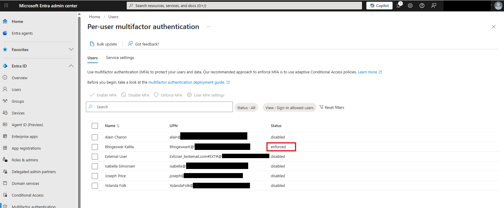
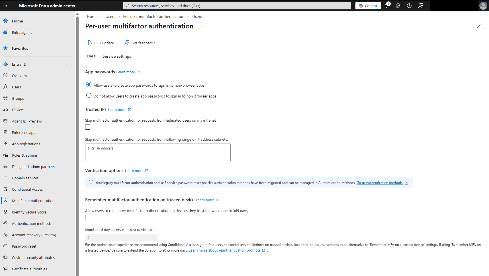
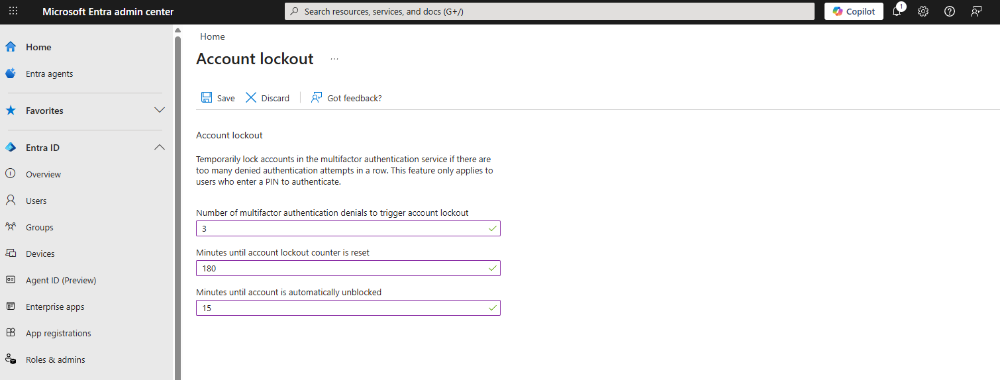

# Lab: Configuring Multi-Factor Authentication (MFA) and Security Lockouts

## Project Overview
In this lab, I managed the deployment and configuration of Multi-Factor Authentication (MFA) within Microsoft Entra ID. The objective was to strengthen the identity perimeter by enforcing secondary verification methods and establishing strict account lockout policies to mitigate the risk of unauthorized access via credential theft or brute-force attacks.

* Tools Used: Microsoft Entra Admin Center.
* Key Focus: Identity Assurance, Adaptive Security, and Threat Mitigation.

---

## Technical Execution

### 1. Per-User MFA Enforcement
* Task: Manually enable MFA for specific administrative or high-risk accounts.
* Process: Oversaw the transition of user status from disabled to "Enabled" and "Enforced" for selected personnel (e.g., Bhogeswar Kalita). This ensures that the user is prompted to provide a secondary form of identification immediately upon their next sign-in attempt.

### 2. MFA Service Settings and Verification Control
* Task: Define the verification methods and trusted parameters for the tenant.
* Process: Managed the MFA service settings to establish allowed verification options (Email, Mobile, App Code). I reviewed the implementation of App Passwords for legacy compatibility and evaluated Trusted IP ranges to allow for seamless access within secure corporate environments.

### 3. MFA Account Lockout Configuration
* Task: Prevent automated attacks by limiting failed MFA challenges.
* Process: Configured the MFA-specific account lockout triggers to strengthen the tenant's resilience.
* Implementation: 
    * Set a threshold of 3 MFA denials to trigger a lockout.
    * Configured a 180-minute reset counter for lockout attempts.
    * Established a 15-minute automatic unblock duration to balance security with operational availability.

---

## Security Analysis and Best Practices

* Defending Against MFA Fatigue: By setting a low threshold for MFA denials (3), I have implemented a control that prevents "MFA Fatigue" attacks, where an attacker repeatedly triggers notifications hoping the user will eventually approve one.
* Zero Trust Principles: This lab fulfills the "Verify Explicitly" pillar of Zero Trust. By requiring multiple forms of evidence before granting access, we ensure that a compromised password alone is insufficient for an attacker to breach the network.
* Operational Stability: Configuring automatic unblock durations ensures that while the network remains secure against attacks, legitimate users who face temporary technical issues are not permanently locked out, reducing high-priority Help Desk tickets.

---

## Evidence of Completion
> [!NOTE]
> All sensitive Tenant data has been redacted to maintain Operational Security.

### Per-User MFA Status and Enforcement

### MFA Service Settings and Methods

### MFA Account Lockout Thresholds

---

## Learning Credits
This lab is based on the Microsoft Learn module: Configure Microsoft Entra multi-factor authentication.
